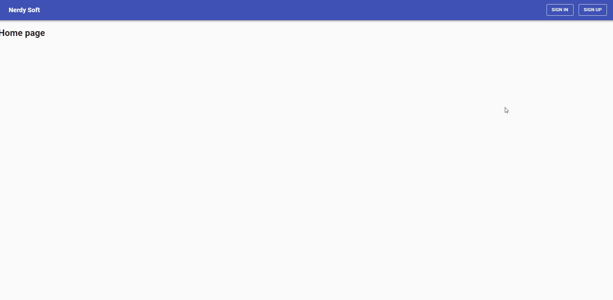

# About this project

This is a full stack development project.

The main features that are present in this project:

- data validation
- registration
- authentication and authorization
- password encryption
- use of database
- create notes
- edit notes
- share notes with another user from at a system
- the one with whom to share the note should see who shared the note

## Demo

## Run Project Locally

1. clone or fork this repository.
2. install all dependencies and devDependencies in to all folders: api, client, root folder
3. at the root folder open terminal and type: **npm run dev**

## Technologies Used

- Node.js
- React.js
- Socket.io
- MongoDB
- ...
